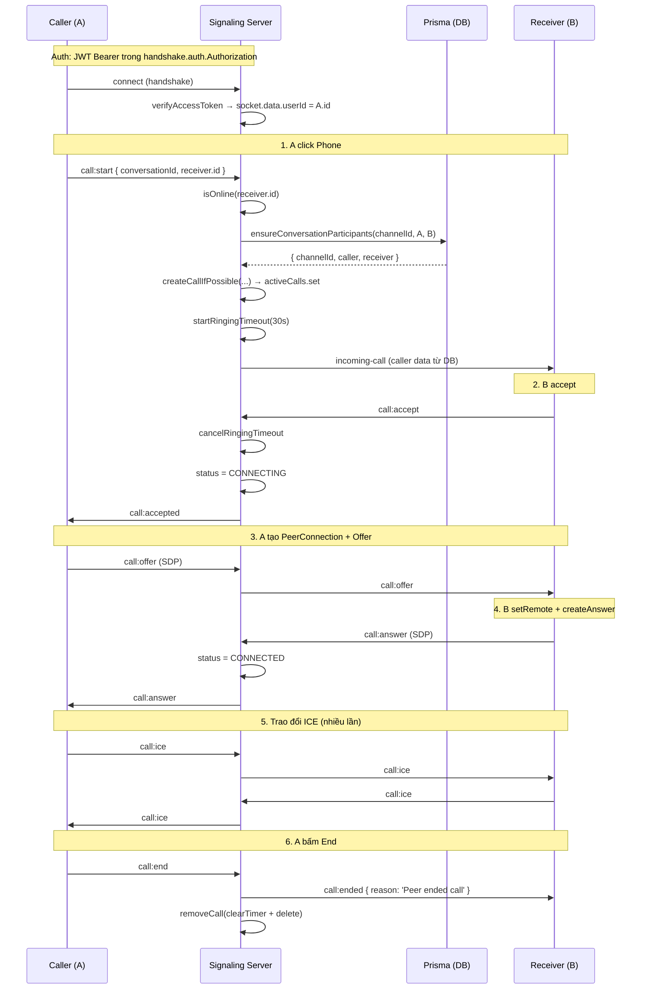

# Backend Call Signaling — Luồng xử lý server-side cho Call 1-1

> Tài liệu đọc trước khi đọc [`src/socket.ts`](D:/VS_CODE/Project/Project-Fullstack/WorkSpace/server/src/socket.ts), [`src/socket/call.gateway.ts`](D:/VS_CODE/Project/Project-Fullstack/WorkSpace/server/src/socket/call.gateway.ts), [`src/socket/active-calls.ts`](D:/VS_CODE/Project/Project-Fullstack/WorkSpace/server/src/socket/active-calls.ts), [`src/socket/online-users.ts`](D:/VS_CODE/Project/Project-Fullstack/WorkSpace/server/src/socket/online-users.ts) và [`src/services/call.participants.service.ts`](D:/VS_CODE/Project/Project-Fullstack/WorkSpace/server/src/services/call.participants.service.ts). Đọc xong tài liệu này, bạn sẽ hiểu được khoảng 80% logic backend trong hệ thống Call.

> Bạn nên đọc [`Document/webrtc-basics.md`](D:/VS_CODE/Project/Project-Fullstack/WorkSpace/server/Document/webrtc-basics.md) trước để hiểu vì sao backend chỉ làm "bà mối" signaling cho WebRTC.

---

## Mục lục

1. [Vai trò của backend trong Call 1-1](#1-vai-trò-của-backend-trong-call-1-1)
2. [Các thuật ngữ bắt buộc nắm](#2-các-thuật-ngữ-bắt-buộc-nắm)
3. [Bảng sự kiện Socket (Server-side view)](#3-bảng-sự-kiện-socket-server-side-view)
4. [State máy server-side của một cuộc gọi](#4-state-máy-server-side-của-một-cuộc-gọi)
5. [Sơ đồ thư mục & trách nhiệm từng file](#5-sơ-đồ-thư-mục--trách-nhiệm-từng-file)
6. [Luồng xử lý tổng thể (Timeline)](#6-luồng-xử-lý-tổng-thể-timeline)
7. [Mapping thuật ngữ → Code](#7-mapping-thuật-ngữ--code)
8. [Phân tích từng handler trong `call.gateway.ts`](#8-phân-tích-từng-handler-trong-callgatewayts)
9. [Phân tích `active-calls.ts` (registry cuộc gọi)](#9-phân-tích-active-callsts-registry-cuộc-gọi)
10. [Phân tích `online-users.ts` (presence)](#10-phân-tích-online-usersts-presence)
11. [Phân tích `call.participants.service.ts` (phân quyền)](#11-phân-tích-callparticipantsservicets-phân-quyền)
12. [Cơ chế bảo mật](#12-cơ-chế-bảo-mật)
13. [Cơ chế timeout, cleanup và lifecycle](#13-cơ-chế-timeout-cleanup-và-lifecycle)
14. [Câu hỏi thường gặp (FAQ)](#14-câu-hỏi-thường-gặp-faq)

---

## 1. Vai trò của backend trong Call 1-1

Backend **KHÔNG xử lý media**. Vai trò của nó là **Signaling Server** — chỉ chuyển tiếp các gói tin nhỏ (offer/answer/ICE/reject/end) giữa 2 client để chúng tự tạo kết nối P2P.

```text
+----------------+        Socket.IO          +----------------------+
| React Frontend | <-----------------------> |  Backend (this file) |
|   (WebRTC)     |     Signaling only        |  Socket.IO + Prisma  |
+----------------+                           +----------------------+
        \                                          ^
         \----- Media (P2P) không qua server -----/
```

**Backend làm 4 việc chính:**

1. **Authenticate** — xác thực mỗi socket bằng JWT trước khi nhận bất kỳ event nào.
2. **Authorize** — kiểm tra caller + receiver là 2 thành viên hợp lệ của channel (DM) trong DB.
3. **Route** — relay (chuyển tiếp) các gói `call:offer`, `call:answer`, `call:ice` tới đúng peer.
4. **Lifecycle** — quản lý state active call, timeout 30s khi đổ chuông, cleanup khi end/disconnect.

**Backend KHÔNG làm:**

- Không gửi/nhận audio/video.
- Không lưu SDP/ICE vào DB.
- Không "nghe" hay "xem" cuộc gọi.
- Không thay đổi nội dung media (mã hóa P2P bởi DTLS-SRTP).

---

## 2. Các thuật ngữ bắt buộc nắm

### 2.1. `socket` vs `io`

```ts
io: Server             // Toàn bộ server Socket.IO, "loa phường" phát thanh
socket: Socket         // Kết nối cá nhân của 1 user, "tai nghe" riêng
```

| API | Ý nghĩa | Ví dụ |
|---|---|---|
| `io.to(socketId).emit(...)` | Nói với 1 socket cụ thể | `io.to(receiverSocketId).emit('incoming-call', ...)` |
| `socket.emit(...)` | Nói với chính socket gửi | `socket.emit('call:error', ...)` |
| `socket.on(event, ...)` | Lắng nghe event từ socket đó | `socket.on('call:start', ...)` |
| `io.on('connection', ...)` | Mỗi khi có client kết nối tới | Đăng ký handler cho socket mới |

### 2.2. User / Socket / Channel

- **User** — thực thể người dùng (id lấy từ JWT).
- **Socket** — 1 kết nối vật lý. Một user có thể mở nhiều tab/phiên = nhiều socket.
- **Channel** — trong hệ thống này, channel DM (1-1) là nơi chứa tin nhắn. Trong call, chúng ta map `channelId` → `conversationId`.
- **Active call** — record in-memory đại diện cho 1 cuộc gọi đang diễn ra, key theo `conversationId`.

### 2.3. Caller / Receiver

| | Vai trò | Quyền gửi |
|---|---|---|
| **Caller** | Người gửi `call:start` | `call:start`, `call:offer`, `call:ice`, `call:end` |
| **Receiver** | Người nhận `incoming-call` | `call:accept`, `call:reject`, `call:answer`, `call:ice`, `call:end` |

### 2.4. `socket.data.userId`

Đây là nơi server lưu `user_id` đã xác thực từ JWT. Mọi handler trong gateway **chỉ tin `socket.data.userId`**, không bao giờ tin `caller.id` / `receiver.id` do client gửi.

### 2.5. Payload convention

- Mọi `id` trên wire protocol (qua socket) là **string** — tránh bigint khi `JSON.stringify`.
- Backend dùng `bigint` khi truy vấn Prisma, convert sang string khi emit.
- `conversationId` trong payload = `channelId` trong DB.

---

## 3. Bảng sự kiện Socket (Server-side view)

Cùng 1 cặp event (ví dụ `call:offer`) có thể vừa được client gửi lên vừa được server relay về. Phân biệt bằng **chiều** chứ không phải tên:

| Client → Server | Vai trò server | Server → Client |
|---|---|---|
| `call:start` | Verify + tạo active call | `incoming-call` |
| `call:accept` | Chuyển state CONNECTING | `call:accepted` |
| `call:reject` | Hủy active call | `call:rejected` |
| `call:offer` | Relay tới peer | `call:offer` |
| `call:answer` | Relay tới peer | `call:answer` |
| `call:ice` | Relay tới peer | `call:ice` |
| `call:end` | Hủy + relay ended | `call:ended` |
| | &nbsp; | `call:error` (khi có lỗi) |

**Payload chính** (xem chi tiết trong [`src/socket/call.types.ts`](D:/VS_CODE/Project/Project-Fullstack/WorkSpace/server/src/socket/call.types.ts)):

```ts
type CallPayload = {
  conversationId: string
  caller: { id: string; name: string; avatar?: string }
  receiver: { id: string; name: string; avatar?: string }
  isVideo: boolean
}

type SDPPayload = CallPayload & { sdp: RTCSessionDescriptionInit }
type IcePayload  = CallPayload & { candidate: RTCIceCandidateInit }
type EndPayload  = { conversationId: string; reason?: string }
type CallErrorPayload = {
  conversationId?: string
  code: 'USER_OFFLINE' | 'CALL_EXISTS' | 'INVALID_PARTICIPANT'
       | 'CALL_NOT_FOUND' | 'NOT_ALLOWED' | 'BAD_PAYLOAD'
  message: string
}
```

---

## 4. State máy server-side của một cuộc gọi

State nằm trong `ActiveCallRecord.status` ở [`src/socket/active-calls.ts`](D:/VS_CODE/Project/Project-Fullstack/WorkSpace/server/src/socket/active-calls.ts):

```
       CALLING  ──── receiver accept ────►  CONNECTING  ──── answer ────►  CONNECTED
          │                                       │                          │
          │ 30s timeout / reject /                │ end / disconnect         │ end / disconnect
          │ caller end                            ▼                          ▼
          └────────────────────────────►        ENDED  ◄────────────────────┘
```

| State | Ý nghĩa | Server cho phép |
|---|---|---|
| `CALLING` | Caller đã gửi `call:start`, chờ receiver accept | `call:accept`, `call:reject`, `call:end` |
| `CONNECTING` | Đã accept, đang trao đổi SDP/ICE | `call:offer`, `call:answer`, `call:ice`, `call:end` |
| `CONNECTED` | Đã relay answer (server không biết P2P đã thông, chỉ là signal) | `call:ice`, `call:end` |
| `ENDED` | Đã cleanup, record đã xóa | (none) |

**Lưu ý:** `CONNECTED` ở server-side chỉ là "đã relay answer thành công", không phải P2P đã thông. P2P thông hay không là việc của browser.

---

## 5. Sơ đồ thư mục & trách nhiệm từng file

```
src/
├── socket.ts                              # Khởi tạo Socket.IO + gắn middleware + register gateway
├── socket/
│   ├── call.gateway.ts                    # Xử lý 7 sự kiện call:*
│   ├── call.types.ts                      # Types, enums (CallEvent, CallStatus, CallErrorCode)
│   ├── active-calls.ts                    # In-memory registry cho active call
│   └── online-users.ts                    # In-memory presence map (userId -> Set<socketId>)
└── services/
    └── call.participants.service.ts       # Verify channel + 2 participant trong DB
```

| File | Trách nhiệm |
|---|---|
| `src/socket.ts` | Tạo `Server`, middleware xác thực JWT, track presence, register gateway, các event chat (`join_channel`, `send_message`, ...) |
| [`src/socket/call.gateway.ts`](D:/VS_CODE/Project/Project-Fullstack/WorkSpace/server/src/socket/call.gateway.ts) | 7 handler `call:*` + cleanup khi disconnect |
| [`src/socket/active-calls.ts`](D:/VS_CODE/Project/Project-Fullstack/WorkSpace/server/src/socket/active-calls.ts) | CRUD cho active call, ringing timeout 30s |
| [`src/socket/online-users.ts`](D:/VS_CODE/Project/Project-Fullstack/WorkSpace/server/src/socket/online-users.ts) | Map userId ↔ socketId, multi-tab friendly |
| [`src/socket/call.types.ts`](D:/VS_CODE/Project/Project-Fullstack/WorkSpace/server/src/socket/call.types.ts) | Types, enums dùng chung |
| [`src/services/call.participants.service.ts`](D:/VS_CODE/Project/Project-Fullstack/WorkSpace/server/src/services/call.participants.service.ts) | Query Prisma kiểm tra channel DM + 2 user |

---

## 6. Luồng xử lý tổng thể (Timeline)



**Mô tả từng giai đoạn:**

| # | Giai đoạn | Server xử lý | Có DB? |
|---|---|---|---|
| 0 | Auth | `verifyAccessToken` + set `socket.data.userId` | Không |
| 1 | Caller start | verify online + verify channel + tạo active call + 30s timeout | Có (1 query) |
| 2 | Receiver accept | cancel timeout + status `CONNECTING` + relay `call:accepted` | Không |
| 3 | Offer | chỉ relay, không parse SDP | Không |
| 4 | Answer | chỉ relay + status `CONNECTED` | Không |
| 5 | ICE | chỉ relay (nhiều lần) | Không |
| 6 | End / disconnect | `removeCall` + clear timer + báo peer | Không |

---

## 7. Mapping thuật ngữ → Code

### 7.1. `src/socket.ts`

```ts
io.use(...)                  // JWT middleware: verify access token
io.on('connection', socket) {
  addSocket(userId, socket.id)          // đăng ký presence
  registerCallGateway(io, socket)       // gắn 7 handler call:*
  socket.on('join_channel', ...)        // chat (giữ nguyên)
  socket.on('send_message', ...)        // chat (giữ nguyên)
  socket.on('disconnect', ...) { removeSocket(socket.id) }
}
```

### 7.2. `src/socket/call.gateway.ts`

```ts
registerCallGateway(io, socket) {
  // Lấy userId đã verify (KHÔNG tin client)
  const userId = socket.data.userId

  socket.on('disconnect', handleDisconnectCleanup)

  socket.on('call:start', ...)   // 1. verify + tạo active call
  socket.on('call:accept', ...)  // 2. accept
  socket.on('call:reject', ...)  // 3. reject
  socket.on('call:offer', ...)   // 4. relay SDP offer
  socket.on('call:answer', ...)  // 5. relay SDP answer
  socket.on('call:ice', ...)     // 6. relay ICE candidate
  socket.on('call:end', ...)     // 7. hủy + relay ended
}
```

### 7.3. `src/socket/active-calls.ts`

```ts
const activeCalls = new Map<string, ActiveCallRecord>()

createCallIfPossible(...)   // tạo (nếu chưa có call trùng conversation/user)
getActiveCallByConversation // tra cứu
updateCallStatus(...)       // CALLING → CONNECTING → CONNECTED
removeCall(...)             // cleanup + clear timer
startRingingTimeout(...)    // 30s; nếu không ai accept → call:ended
```

### 7.4. `src/socket/online-users.ts`

```ts
addSocket(userId, socketId)        // thêm tab mới
removeSocket(socketId)             // rời 1 tab
getSocketIds(userId)               // lấy tất cả tab của user
isOnline(userId)                   // check nhanh
```

### 7.5. `src/services/call.participants.service.ts`

```ts
ensureConversationParticipants({
  channelId, callerId, receiverId
}) → { channelId, caller, receiver } | null
// trả null nếu channel không tồn tại / không phải DM /
// hoặc 1 trong 2 user không thuộc channel
```

---

## 8. Phân tích từng handler trong `call.gateway.ts`

### 8.1. `call:start` — Caller bắt đầu cuộc gọi

```ts
socket.on(CallEvent.CALL_START, async (raw) => {
  const payload = safeParse<CallPayload>(raw)
  // 1. Validate payload
  if (!payload || !payload.conversationId || !payload.caller || !payload.receiver)
    return emitError(socket, BAD_PAYLOAD, ...)

  // 2. Lấy userId từ JWT (không tin payload.caller.id)
  const callerId = userId
  const receiverId = payload.receiver.id

  // 3. Không tự gọi chính mình
  if (callerId === receiverId) return emitError(..., INVALID_PARTICIPANT, ...)

  // 4. Receiver phải online
  if (!isOnline(receiverId)) return emitError(..., USER_OFFLINE, ...)

  // 5. Verify channel + 2 user thuộc channel (DB)
  const participants = await ensureConversationParticipants({...})
  if (!participants) return emitError(..., INVALID_PARTICIPANT, ...)

  // 6. Chuẩn hóa payload từ DB (data luôn đúng)
  const normalizedPayload = { ... }

  // 7. Tạo active call (fail nếu đã có call trùng)
  const create = await createCallIfPossible({...})
  if (!create.ok) return emitError(..., CALL_EXISTS, ...)

  // 8. Start 30s ringing timeout
  startRingingTimeout(...)

  // 9. Gửi incoming-call cho 1 socket của receiver
  io.to(receiverSocketId).emit('incoming-call', normalizedPayload)
})
```

**Bảo mật:** Bước 2 và 5 đảm bảo người gửi `call:start`:
- Có JWT hợp lệ (đã verify ở middleware).
- Là thành viên của channel.
- Có quyền gọi receiver (cùng channel).

**Tại sao lại query DB?** để chặn việc client gửi payload giả mạo. Ví dụ user A gửi `caller.id = "999"` (admin) để spoof.

### 8.2. `call:accept` — Receiver đồng ý

```ts
socket.on(CallEvent.CALL_ACCEPT, async (raw) => {
  const call = getActiveCallByConversation(payload.conversationId)
  if (!call) return emitError(..., CALL_NOT_FOUND, ...)       // chưa start
  if (call.receiverId !== userId) return emitError(..., NOT_ALLOWED, ...)  // không phải receiver
  if (call.status !== CALLING) return emitError(..., NOT_ALLOWED, ...)   // đã accept/reject rồi

  cancelRingingTimeout(call.conversationId)   // tắt 30s timeout
  attachReceiverSocket(call.conversationId, socket.id)  // gắn socket nhận
  updateCallStatus(call.conversationId, CONNECTING)

  // Báo caller (tất cả tab của caller)
  for (const sId of getSocketIds(call.callerId)) {
    io.to(sId).emit('call:accepted', payload)
  }
})
```

**Lưu ý:** Chỉ relay đến **tất cả** socket của caller. Caller có thể mở nhiều tab; chỉ tab nào gửi `call:start` mới cần, nhưng gửi cho cả các tab còn lại cũng không sao (đều là cùng 1 user).

### 8.3. `call:reject` — Receiver từ chối

Tương tự `call:accept` nhưng:
- Không cần check `status === CALLING` (cho phép reject khi đang CONNECTING? — Phase 1 thì không).
- Sau khi relay `call:rejected`, gọi `removeCall(...)` để xóa record.

### 8.4. `call:offer` — Caller gửi SDP offer

```ts
socket.on(CallEvent.CALL_OFFER, async (raw) => {
  const call = getActiveCallByConversation(payload.conversationId)
  if (!call) return emitError(..., CALL_NOT_FOUND, ...)
  if (call.callerId !== userId) return emitError(..., NOT_ALLOWED, ...)  // chỉ caller
  if (call.status !== CONNECTING && call.status !== CONNECTED) return emitError(..., NOT_ALLOWED, ...)

  // Relay tới peer (receiver)
  for (const sId of getPeerSocketIds(call, userId)) {
    io.to(sId).emit('call:offer', payload)
  }
})
```

**Server KHÔNG đọc nội dung SDP.** Nó chỉ xác minh "đây là caller, có active call, đúng state" rồi chuyển nguyên xi.

### 8.5. `call:answer` — Receiver gửi SDP answer

Tương tự `call:offer`, nhưng:
- Caller chuyển `status` từ `CONNECTING` → `CONNECTED`.
- Relay cho caller.

Nhắc lại: `CONNECTED` ở server chỉ là "đã relay answer", không phải "P2P thông".

### 8.6. `call:ice` — Trao đổi ICE candidate

```ts
socket.on(CallEvent.CALL_ICE, async (raw) => {
  const call = getActiveCallByConversation(payload.conversationId)
  if (!call) return emitError(..., CALL_NOT_FOUND, ...)
  if (call.callerId !== userId && call.receiverId !== userId)
    return emitError(..., NOT_ALLOWED, ...)
  if (call.status === CALLING || call.status === ENDED) return  // ICE trước accept hoặc sau end đều bỏ

  // Relay tới peer
})
```

**Lưu ý:** Số lượng ICE candidate có thể rất lớn (mỗi browser gửi hàng chục). Server chỉ forward, không lưu, không kiểm tra nội dung.

### 8.7. `call:end` — Bấm End

```ts
socket.on(CallEvent.CALL_END, async (raw) => {
  const call = getActiveCallByConversation(conversationId)
  if (!call) {
    // Idempotent: gọi end 2 lần cũng OK
    socket.emit('call:ended', { conversationId, reason: 'Call already ended' })
    return
  }
  if (call.callerId !== userId && call.receiverId !== userId)
    return emitError(..., NOT_ALLOWED, ...)

  // Báo peer
  const peerId = getPeerUserId(call, userId)
  for (const sId of getSocketIds(peerId)) {
    io.to(sId).emit('call:ended', { conversationId, reason: 'Peer ended call' })
  }

  removeCall(conversationId)   // clear timer + delete record
})
```

**Idempotent:** Nếu client gửi `call:end` 2 lần (do button bấm 2 cái, hoặc network retry), server vẫn handle nhẹ nhàng — không crash, không emit ended 2 lần.

### 8.8. `disconnect` — User mất kết nối

```ts
const handleDisconnectCleanup = () => {
  const calls = findCallsByUser(userId)
  for (const call of calls) {
    notifyEndToPeers(io, call.conversationId, call.callerId, call.receiverId, 'Peer disconnected')
    removeCall(call.conversationId)
  }
}
socket.on('disconnect', handleDisconnectCleanup)
```

Nếu user đang trong call mà disconnect (đóng tab, mất mạng):
- Tìm tất cả call liên quan tới user.
- Báo peer `call:ended { reason: 'Peer disconnected' }`.
- Cleanup active call.

**Lưu ý:** Cleanup **chỉ chạy khi socket disconnect**, không cleanup khi user chỉ "offline" trên 1 tab mà vẫn còn tab khác. `userSockets` đảm bảo user chỉ tính offline khi tất cả socket đều đóng.

---

## 9. Phân tích `active-calls.ts` (registry cuộc gọi)

### 9.1. Cấu trúc dữ liệu

```ts
const activeCalls = new Map<string, ActiveCallRecord>()

type ActiveCallRecord = {
  conversationId: string       // key = channelId
  callerId: string
  receiverId: string
  isVideo: boolean
  status: 'CALLING' | 'CONNECTING' | 'CONNECTED' | 'ENDED'
  callerSocketId: string
  receiverSocketId: string | null   // null cho đến khi accept
  createdAt: number
  ringingTimer: NodeJS.Timeout | null
}
```

**Key = `conversationId`** (channelId). Lý do: trong 1 channel, chỉ có 1 cuộc gọi 1-1 tại 1 thời điểm.

### 9.2. `createCallIfPossible` — Tạo có điều kiện

```ts
if (activeCalls.has(conversationId)) return { ok: false, reason: 'CALL_EXISTS' }
if (isUserInAnyCall(callerId))       return { ok: false, reason: 'CALL_EXISTS' }
if (isUserInAnyCall(receiverId))     return { ok: false, reason: 'CALL_EXISTS' }

// Tạo record với status = CALLING
const record = { status: 'CALLING', ringingTimer: null, ... }
activeCalls.set(conversationId, record)
return { ok: true, call: record }
```

**3 điều kiện fail:**
1. Channel này đã có call đang active.
2. Caller đang trong call khác (với ai đó).
3. Receiver đang trong call khác.

→ Trả về `CALL_EXISTS` để frontend hiển thị "Bạn/B đang trong cuộc gọi khác".

### 9.3. `startRingingTimeout` — Timeout 30s đổ chuông

```ts
call.ringingTimer = setTimeout(() => {
  const c = activeCalls.get(conversationId)
  if (c && c.status === CALLING) {
    onTimeout(c)   // gọi callback handleTimeout
  }
}, 30_000)
```

**Quy tắc quan trọng:**
- Chỉ fire **nếu vẫn ở `CALLING`** (tức là chưa ai accept/reject).
- Sau khi accept → `cancelRingingTimeout` (xem 9.4).
- Callback `onTimeout` chính là `handleTimeout` trong gateway, gửi `call:ended` cho cả 2 bên với reason `Ringing timeout`.

### 9.4. `cancelRingingTimeout` & `removeCall` — Cleanup an toàn

```ts
const clearTimer = (call) => {
  if (call.ringingTimer) {
    clearTimeout(call.ringingTimer)
    call.ringingTimer = null
  }
}

export const removeCall = (conversationId) => {
  const call = activeCalls.get(conversationId)
  if (!call) return null
  clearTimer(call)            // quan trọng: clear timer
  activeCalls.delete(conversationId)
  return call
}
```

**Không gọi `clearTimer` = memory leak.** Node giữ timeout trong event loop, giữ reference tới `call`, giữ reference tới `activeCalls` map. Sau nhiều cuộc gọi, RAM sẽ phình.

### 9.5. `findCallsByUser` — Cleanup khi disconnect

```ts
export const findCallsByUser = (userId: string) => {
  const result = []
  for (const call of activeCalls.values()) {
    if (call.callerId === userId || call.receiverId === userId) {
      result.push(call)
    }
  }
  return result
}
```

Tìm tất cả call liên quan tới user. Dùng cho `handleDisconnectCleanup` trong gateway.

Vì call là 1-1, mỗi user chỉ có tối đa 1 call tại 1 thời điểm, nên loop này thực ra trả về 0 hoặc 1 phần tử. Nhưng giữ tổng quát để sau này mở rộng group call.

---

## 10. Phân tích `online-users.ts` (presence)

### 10.1. Hai map song song

```ts
const userSockets = new Map<UserId, Set<SocketId>>()   // user -> nhiều socket
const socketToUser = new Map<SocketId, UserId>()       // socket -> 1 user
```

**Tại sao 2 map?**
- `userSockets` hỗ trợ "user có nhiều tab" → emit cho tất cả tab.
- `socketToUser` hỗ trợ cleanup theo socket khi disconnect.

### 10.2. `addSocket` / `removeSocket`

```ts
addSocket(userId, socketId) {
  socketToUser.set(socketId, userId)
  userSockets.get(userId)?.add(socketId)
    ?? userSockets.set(userId, new Set([socketId]))
}

removeSocket(socketId) {
  const userId = socketToUser.get(socketId)
  if (!userId) return null
  socketToUser.delete(socketId)
  const set = userSockets.get(userId)
  set?.delete(socketId)
  if (set && set.size === 0) userSockets.delete(userId)
  return userId
}
```

**Multi-tab friendly:**
- Open tab 1 → `userSockets['A'] = {s1}`, `socketToUser = {s1: 'A'}`
- Open tab 2 → `userSockets['A'] = {s1, s2}`, `socketToUser = {s1: 'A', s2: 'A'}`
- Close tab 1 → `userSockets['A'] = {s2}`, `socketToUser = {s2: 'A'}` (user vẫn online)
- Close tab 2 → `userSockets.delete('A')` (user offline)

### 10.3. `isOnline` / `getSocketIds`

```ts
isOnline(userId) {
  const set = userSockets.get(userId)
  return !!set && set.size > 0
}

getSocketIds(userId) {
  return Array.from(userSockets.get(userId) ?? [])
}
```

- `isOnline` — check nhanh trước khi gửi `incoming-call`.
- `getSocketIds` — emit cho tất cả tab của user (dùng cho `call:accepted`, `call:rejected`, `call:ended`).

---

## 11. Phân tích `call.participants.service.ts` (phân quyền)

### 11.1. `ensureConversationParticipants`

```ts
async function ensureConversationParticipants({ channelId, callerId, receiverId }) {
  // 1. Validate input (channelId phải là số hợp lệ, caller ≠ receiver)
  // 2. Query DB
  const channel = await prisma.channel.findFirst({
    where: {
      id: BigInt(channelId),
      type: 'DM',
      AND: [
        { members: { some: { userId: BigInt(callerId) } } },
        { members: { some: { userId: BigInt(receiverId) } } }
      ]
    },
    include: { members: { include: { user: { select: { id, displayName, username, avatar, fullName } } } } }
  })
  if (!channel) return null   // channel không tồn tại / không phải DM / 1 user không thuộc channel

  // 3. Trích thông tin 2 user thực tế từ DB
  return { channelId, caller, receiver }
}
```

**Đây là tuyến phòng thủ quan trọng nhất.** Trả về `null` khi:
- Channel không tồn tại.
- Channel không phải DM (ví dụ channel group).
- Caller không thuộc channel.
- Receiver không thuộc channel.

### 11.2. Vì sao cần query DB?

Nếu chỉ tin payload client:
- User A có thể gửi `receiver.id = "B"` mà A không thuộc channel với B.
- User A có thể gửi `caller.id = "admin"` để spoof.
- User A có thể gọi channel ngẫu nhiên (channelId 9999 ngay cả khi A không thuộc channel đó).

Query DB đảm bảo mọi cuộc gọi phải qua **2 thành viên thật** của channel.

### 11.3. Normalize payload

Sau khi query DB, server **luôn** dùng data từ DB (không tin client):

```ts
const normalizedPayload = {
  conversationId: participants.channelId,    // từ DB
  caller: { id, name, avatar } : participants.caller,    // từ DB
  receiver: { id, name, avatar } : participants.receiver,    // từ DB
  isVideo: !!payload.isVideo    // boolean, không nhạy cảm
}
```

→ Client không thể gửi tên/avatar sai để spoof.

### 11.4. `isChannelMember` (helper)

```ts
async function isChannelMember(channelId, userId) {
  const count = await prisma.channelMember.count({ where: { channelId, userId } })
  return count > 0
}
```

Dùng cho các check phụ nếu cần. Hiện tại gateway không dùng trực tiếp mà dùng `ensureConversationParticipants` (chặt hơn).

---

## 12. Cơ chế bảo mật

Bảo mật backend dựa trên 4 lớp:

### 12.1. JWT Auth (Lớp 1)

```ts
io.use(async (socket, next) => {
  const { Authorization } = socket.handshake.auth
  if (!Authorization) return next(new Error('Unauthorized'))
  const access_token = Authorization.split(' ')[1]
  const decoded = await verifyAccessToken(access_token)
  socket.data.userId = decoded.user_id  // gắn userId
  next()
})
```

**Chặn:**
- Không có `Authorization` → `Unauthorized`.
- Token hết hạn → `JwtWebTokenError` → `Unauthorized`.
- Token sai chữ ký → `Unauthorized`.

### 12.2. Không tin client (Lớp 2)

```ts
const callerId = userId  // từ socket.data.userId
// KHÔNG dùng payload.caller.id
```

Mọi quyết định "ai là caller" đều dựa trên `socket.data.userId` (từ JWT), không bao giờ dựa trên `payload.caller.id`.

### 12.3. Verify participant trong DB (Lớp 3)

```ts
const participants = await ensureConversationParticipants({ channelId, callerId, receiverId })
if (!participants) return emitError(..., INVALID_PARTICIPANT, ...)
```

Đảm bảo 2 user thực sự là thành viên của channel (DM).

### 12.4. Authorize per-event (Lớp 4)

Mỗi handler đều check người gửi có đúng vai trò không:

| Event | Check |
|---|---|
| `call:accept` | `call.receiverId === userId` |
| `call:reject` | `call.receiverId === userId` |
| `call:offer`  | `call.callerId === userId` |
| `call:answer` | `call.receiverId === userId` |
| `call:ice`    | `call.callerId === userId \|\| call.receiverId === userId` |
| `call:end`    | `call.callerId === userId \|\| call.receiverId === userId` |

→ User không phải participant không thể gây nhiễu cuộc gọi.

### 12.5. Validate payload shape

Mọi handler đều check:
```ts
const payload = safeParse<T>(raw)
if (!payload || typeof payload.conversationId !== 'string') return emitError(..., BAD_PAYLOAD, ...)
```

→ Payload xấu (không phải object, thiếu field, sai kiểu) không gây crash gateway.

---

## 13. Cơ chế timeout, cleanup và lifecycle

### 13.1. Ringing timeout 30s

```ts
startRingingTimeout(call.conversationId, (c) => handleTimeout(io, ...))

// Trong handleTimeout:
notifyEndToPeers(io, conversationId, callerId, receiverId, 'Ringing timeout')
removeCall(conversationId)
```

**Timeline:**

```
T+0s     call:start       → status=CALLING, startRingingTimeout
T+0s     incoming-call    → receiver thấy modal
T+30s    timeout fire     → call:ended { reason: 'Ringing timeout' } cho cả 2
                          → removeCall
```

**Cancel timeout khi:**
- `call:accept` → `cancelRingingTimeout`
- `call:reject` → `removeCall` (trong đó có `clearTimer`)
- `call:end` (caller tự hủy) → `removeCall`
- Disconnect → `removeCall`

### 13.2. Disconnect cleanup

```ts
socket.on('disconnect', () => {
  handleDisconnectCleanup()  // trong gateway
  removeSocket(socket.id)     // trong socket.ts
})
```

**2 việc cần làm khi 1 socket disconnect:**
1. Cleanup call: tìm call liên quan, báo peer, xóa record.
2. Cleanup presence: xóa socket khỏi `userSockets`.

```ts
// Gateway (cleanup call)
const handleDisconnectCleanup = () => {
  const calls = findCallsByUser(userId)
  for (const call of calls) {
    notifyEndToPeers(io, ..., 'Peer disconnected')
    removeCall(call.conversationId)
  }
}

// socket.ts (cleanup presence)
const onDisconnect = () => removeSocket(socket.id)
```

### 13.3. Idempotency

Mọi hành động "kết thúc" đều idempotent:

| Hành động | Lần 1 | Lần 2 |
|---|---|---|
| `call:end` (call tồn tại) | báo peer + removeCall | call đã bị xóa → emit ended, reason 'Call already ended' |
| `call:end` (call không tồn tại) | emit ended, reason 'Call already ended' | (đã emit, nhưng socket có thể không nhận do reconnect) |
| `call:reject` (call không tồn tại) | return `CALL_NOT_FOUND` | (không crash) |
| Disconnect (call đã ended) | removeCall trả null | (loop không crash) |

### 13.4. In-memory limitations

```ts
const activeCalls = new Map<string, ActiveCallRecord>()  // in-memory
const userSockets = new Map<UserId, Set<SocketId>>()     // in-memory
```

**Hạn chế:**
- Chỉ phù hợp **1 Node instance**.
- Restart server → mất hết active call + presence.
- Nhiều instance (PM2 cluster, Kubernetes) → mỗi instance có map riêng, user A ở instance 1 không thấy user B ở instance 2.

**Khi scale**, cần:
- Dùng [Redis adapter](https://socket.io/docs/v4/redis-adapter/) cho Socket.IO.
- Dùng Redis hash cho `activeCalls`, `userSockets`.

---

## 14. Câu hỏi thường gặp (FAQ)

### Q1. Tại sao `call:start` lại query DB, không chỉ check online?

Vì `isOnline` chỉ check "user có đang kết nối socket", không check "user có được phép gọi user kia". Query DB đảm bảo:

- Channel phải tồn tại.
- Channel phải là DM.
- Cả 2 user phải thuộc channel.

Nếu không query, user A có thể gọi user B dù chưa từng nói chuyện.

### Q2. Tại sao `caller.id` lấy từ JWT mà không từ payload?

Vì client có thể gửi payload giả mạo. Ví dụ:
```js
// Gói call:start bị client sửa
socket.emit('call:start', { caller: { id: 'admin_id', name: 'Admin' }, ... })
```

Server phải override `callerId = userId` (từ JWT) để chặn.

### Q3. Tại sao cần chuyển `call:offer` qua server chứ không gửi thẳng P2P?

Vì WebRTC **không tự biết** peer đang ở địa chỉ nào. Signaling server chỉ là "bà mối" giới thiệu 2 bên trước khi họ tự nối P2P. Media thực sự đi thẳng P2P, không qua server.

### Q4. `call:offer` và `call:ice` có được broadcast không?

Không. Chỉ relay tới **đúng peer** (caller ↔ receiver):
```ts
const peerSocketIds = getPeerSocketIds(call, userId)
for (const sId of peerSocketIds) {
  io.to(sId).emit('call:offer', payload)
}
```

Không broadcast qua channel room — channel có thể có nhiều member, mà call là 1-1.

### Q5. Server có lưu SDP / ICE không?

Không. Server chỉ relay. SDP và ICE được forward thẳng từ client này sang client kia mà không qua DB.

### Q6. Tại sao dùng `socket.data.userId` mà không lookup lại từ `handshake.auth`?

Vì `socket.data` là nơi Socket.IO khuyến nghị lưu data riêng cho socket. `handshake.auth` chỉ chứa data lúc kết nối (immutable sau handshake). `socket.data` có thể chỉnh sửa và là global cho socket đó.

### Q7. Cleanup khi nào?

| Sự kiện | Cleanup gì |
|---|---|
| `call:accept` | cancelRingingTimeout |
| `call:reject` | removeCall (clear timer + delete) |
| `call:end` | removeCall |
| `call:timeout` (30s) | notifyEndToPeers + removeCall |
| `disconnect` | notifyEndToPeers + removeCall + removeSocket |

### Q8. Multi-tab thì sao?

User A mở 2 tab (Chrome + Edge):
- `userSockets['A'] = {socket1, socket2}`
- A gửi `call:start` từ socket1 → server gửi `incoming-call` tới socket2 (chỉ 1 socket đầu tiên được gửi để tránh duplicate).
- A bấm End từ socket2 → relay `call:ended` cho peer, và `removeCall` xóa record (chỉ 1 call dù có 2 tab).

### Q9. Tại sao state `CONNECTED` ở server nhưng P2P có thể chưa thông?

Vì `CONNECTED` chỉ nghĩa "đã relay answer thành công". Browser nhận answer → vẫn cần đợi ICE candidate chung → mới có P2P. Server không biết P2P thông hay không (vì không thấy media). Browser tự biết qua `RTCPeerConnection.connectionState`.

### Q10. Làm sao test signaling mà không cần 2 browser?

Dùng `socket.io-client` từ Node:
```ts
import { io } from 'socket.io-client'

const alice = io('http://localhost:3000', { auth: { Authorization: `Bearer ${tokenA}` } })
const bob   = io('http://localhost:3000', { auth: { Authorization: `Bearer ${tokenB}` } })

alice.on('connect', () => {
  alice.emit('call:start', { conversationId: '1', caller: { id: 'A' }, receiver: { id: 'B' }, isVideo: false })
})
bob.on('incoming-call', (p) => {
  console.log('Bob received incoming-call', p)
  bob.emit('call:accept', p)
})
```

Backend không cần media thật, chỉ cần verify event routing.

### Q11. Khi scale nhiều server, cần làm gì?

- Thay `userSockets` và `activeCalls` in-memory bằng Redis.
- Dùng `socket.io-redis-adapter` để sync event giữa các instance.
- Vì SDP/ICE có thể lớn, nên đặt TTL ngắn cho record Redis (5-30s) hoặc dùng Pub/Sub.

### Q12. Tại sao cleanup cả presence trong `socket.ts` lẫn cleanup call trong gateway?

Vì 2 việc khác nhau:
- **Presence** (`socket.ts`) — là việc chung, dùng cho cả chat lẫn call.
- **Call cleanup** (`gateway`) — chỉ liên quan call, cần báo peer.

Nếu gộp vào 1 chỗ, sẽ vi phạm separation of concerns: chat không nên biết về call.

### Q13. Server có cần HTTPS không?

- **Có** cho `getUserMedia` (frontend xin cam/mic cần HTTPS hoặc localhost).
- **Không** cho socket signaling (HTTP là đủ, vì chỉ truyền metadata).
- Production: nên chạy sau reverse proxy (nginx) terminate TLS.

### Q14. Log nào hữu ích khi debug?

```ts
// Thêm log trong connection handler
console.log(`user ${userId} connected with socket ${socket.id}, total sockets:`, getSocketIds(user_id).length)

// Log trong start
console.log(`[call:start] ${callerId} -> ${receiverId}, conversation ${conversationId}`)

// Log trong cleanup
console.log(`[call:end] ${conversationId} ended, reason: ${reason}`)
```

---

## Tóm tắt 1 dòng

| Khái niệm | Tóm tắt |
|---|---|
| **Backend role** | Signaling server, route 7 event `call:*` |
| **Auth** | JWT Bearer ở `handshake.auth.Authorization` |
| **Authorize** | Caller từ JWT, participant verify qua Prisma |
| **Active call** | in-memory Map, key = `conversationId` |
| **Ringing timeout** | 30s, auto-end nếu không accept |
| **Disconnect** | Cleanup call + presence, báo peer |
| **In-memory** | Chỉ 1 instance; scale cần Redis adapter |

---

## Thứ tự đọc code đề xuất

Sau khi đọc tài liệu này, bạn đọc code theo thứ tự:

1. [`src/socket/online-users.ts`](D:/VS_CODE/Project/Project-Fullstack/WorkSpace/server/src/socket/online-users.ts) — hiểu presence map (60 dòng).
2. [`src/socket/call.types.ts`](D:/VS_CODE/Project/Project-Fullstack/WorkSpace/server/src/socket/call.types.ts) — hiểu types + enums.
3. [`src/socket/active-calls.ts`](D:/VS_CODE/Project/Project-Fullstack/WorkSpace/server/src/socket/active-calls.ts) — hiểu registry cuộc gọi.
4. [`src/services/call.participants.service.ts`](D:/VS_CODE/Project/Project-Fullstack/WorkSpace/server/src/services/call.participants.service.ts) — hiểu verify participant.
5. [`src/socket/call.gateway.ts`](D:/VS_CODE/Project/Project-Fullstack/WorkSpace/server/src/socket/call.gateway.ts) — hiểu 7 handler.
6. [`src/socket.ts`](D:/VS_CODE/Project/Project-Fullstack/WorkSpace/server/src/socket.ts) — hiểu cách gắn gateway vào connection.

Mỗi file sẽ "khớp" với 1 phần trong tài liệu này.
