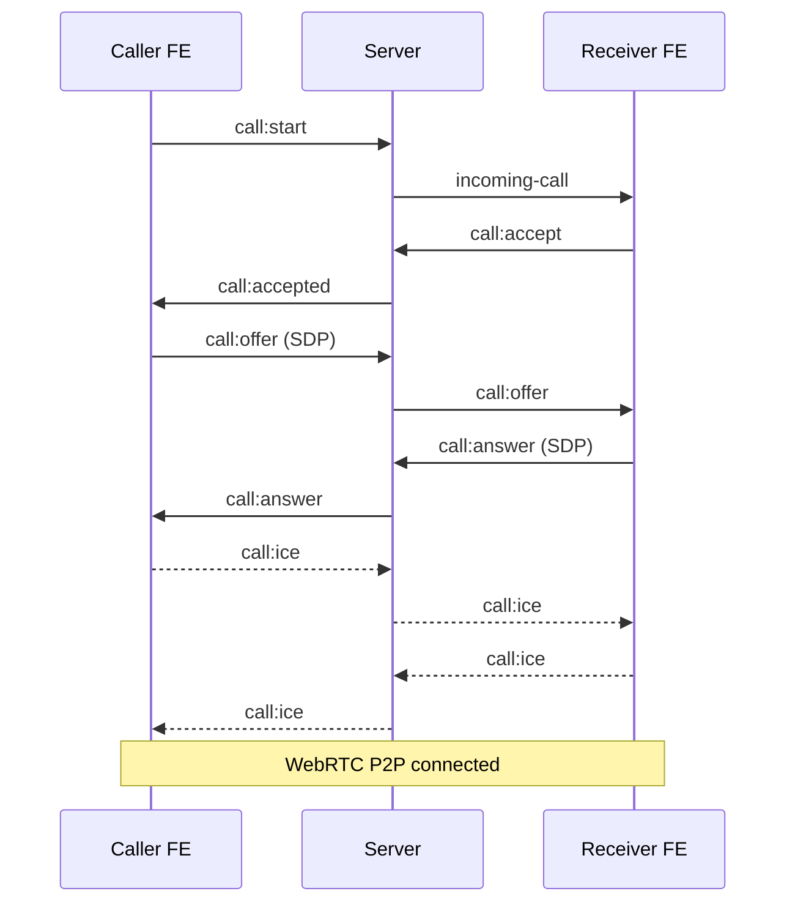

# Hướng dẫn triển khai Call - Video 1-1 (Phase 1)

> Tài liệu đọc trước khi code. Mục tiêu: làm được Audio Call + Video Call 1-1, Accept / Reject / End Call.
> Kiến trúc: **WebRTC P2P + Socket.IO làm Signaling Server**. Không lưu database.

---

## Mục lục

1. [Tổng quan kiến trúc](#1-tổng-quan-kiến-trúc)
2. [Bảng sự kiện Socket](#2-bảng-sự-kiện-socket)
3. [State máy của cuộc gọi](#3-state-máy-của-cuộc-gọi)
4. [Triển khai Backend](#4-triển-khai-backend)
5. [Triển khai Frontend](#5-triển-khai-frontend)
6. [Xử lý lỗi](#6-xử-lý-lỗi)
7. [Test E2E](#7-test-e2e)

---

## 1. Tổng quan kiến trúc

```
+----------------+        Socket.IO          +------------------+
| React Frontend | <-----------------------> | Signaling Server |
|  (WebRTC)      |                           |  (Node + Socket) |
+----------------+                           +------------------+
        \                                          /
         \----------- Media (P2P qua WebRTC) -----/
```

- Server **chỉ truyền tín hiệu**: Offer, Answer, ICE, Reject, End.
- Media (audio/video) đi trực tiếp giữa 2 trình duyệt, không qua server.
- Sử dụng STUN mặc định `stun:stun.l.google.com:19302` (đủ cho môi trường dev).




---


## 2. Bảng sự kiện Socket


| Client → Server | Server → Client |
| --------------- | --------------- |
| `call:start`    | `incoming-call` |
| `call:accept`   | `call:accepted` |
| `call:reject`   | `call:rejected` |
| `call:offer`    | `call:offer`    |
| `call:answer`   | `call:answer`   |
| `call:ice`      | `call:ice`      |
| `call:end`      | `call:ended`    |


**Payload chung**

```ts
type CallPayload = {
  conversationId: string;
  caller: { id: string; name: string; avatar?: string };
  receiver: { id: string; name: string; avatar?: string };
  isVideo: boolean;
};

type SDPPayload = CallPayload & {
  sdp: RTCSessionDescriptionInit;
};

type IcePayload = CallPayload & {
  candidate: RTCIceCandidateInit;
};
```

---


## 3. State máy của cuộc gọi

```
IDLE  →  CALLING  →  RINGING  →  CONNECTING  →  CONNECTED  →  ENDED
```


| State        | Ý nghĩa                                          |
| ------------ | ------------------------------------------------ |
| `IDLE`       | Không có cuộc gọi                                |
| `CALLING`    | Caller đã gửi offer, đang chờ receiver accept    |
| `RINGING`    | Receiver đã nhận `incoming-call`, đang đổ chuông |
| `CONNECTING` | Đã accept, đang trao đổi SDP/ICE                 |
| `CONNECTED`  | WebRTC đã kết nối P2P                            |
| `ENDED`      | Cuộc gọi kết thúc, sẵn sàng reset về `IDLE`      |


---


## 4. Triển khai Backend


### 4.1 Cài đặt

```bash
npm install socket.io
```


### 4.2 Cấu trúc thư mục đề xuất

```
src/
  socket/
    index.ts            # Khởi tạo Socket.IO server
    call.gateway.ts     # Xử lý tất cả sự kiện call:*
  middlewares/
    socket.auth.ts      # Xác thực JWT từ handshake
  utils/
    onlineUsers.ts      # Map<userId, socketId>
  types/
    call.type.ts        # Type cho payload
```


### 4.3 Bước 1 — Khởi tạo [Socket.IO](http://Socket.IO)

`socket/index.ts`

```ts
import { Server } from 'socket.io';
import { socketAuthMiddleware } from '../middlewares/socket.auth';
import { registerCallGateway } from './call.gateway';

export const initSocket = (httpServer: any) => {
  const io = new Server(httpServer, {
    cors: { origin: '*' },
  });

  io.use(socketAuthMiddleware);
  io.on('connection', (socket) => {
    registerCallGateway(io, socket);
  });

  return io;
};
```


### 4.4 Bước 2 — Middleware xác thực

`middlewares/socket.auth.ts`

```ts
import jwt from 'jsonwebtoken';

export const socketAuthMiddleware = (socket: any, next: any) => {
  const token = socket.handshake.auth?.token;
  if (!token) return next(new Error('No token'));

  try {
    const decoded: any = jwt.verify(token, process.env.JWT_SECRET!);
    socket.data.userId = decoded.id;
    next();
  } catch (err) {
    next(new Error('Invalid token'));
  }
};
```


### 4.5 Bước 3 — Quản lý user online

`utils/onlineUsers.ts`

```ts
const onlineUsers = new Map<string, string>(); // userId -> socketId

export const addUser = (userId: string, socketId: string) => {
  onlineUsers.set(userId, socketId);
};

export const removeUser = (socketId: string) => {
  for (const [userId, id] of onlineUsers) {
    if (id === socketId) onlineUsers.delete(userId);
  }
};

export const getSocketId = (userId: string) => onlineUsers.get(userId);
```


### 4.6 Bước 4 — Call Gateway

`socket/call.gateway.ts`

```ts
import { addUser, getSocketId, removeUser } from '../utils/onlineUsers';

// Lưu cuộc gọi đang active (in-memory)
const activeCalls = new Map<string, { callerId: string; receiverId: string }>();

const getPeerId = (payload: any, currentUserId: string) =>
  payload.caller.id === currentUserId ? payload.receiver.id : payload.caller.id;

export const registerCallGateway = (io: any, socket: any) => {
  const userId = socket.data.userId;
  addUser(userId, socket.id);

  socket.on('call:start', (payload: any) => {
    const receiverSocketId = getSocketId(payload.receiver.id);
    if (!receiverSocketId) {
      socket.emit('call:error', { message: 'User offline' });
      return;
    }
    activeCalls.set(payload.conversationId, {
      callerId: payload.caller.id,
      receiverId: payload.receiver.id,
    });
    io.to(receiverSocketId).emit('incoming-call', payload);
  });

  socket.on('call:accept', (payload: any) => {
    const callerSocketId = getSocketId(payload.caller.id);
    if (callerSocketId) io.to(callerSocketId).emit('call:accepted', payload);
  });

  socket.on('call:reject', (payload: any) => {
    const callerSocketId = getSocketId(payload.caller.id);
    if (callerSocketId) io.to(callerSocketId).emit('call:rejected', payload);
    activeCalls.delete(payload.conversationId);
  });

  socket.on('call:offer', (payload: any) => {
    const peerId = getPeerId(payload, userId);
    const peerSocketId = getSocketId(peerId);
    if (peerSocketId) io.to(peerSocketId).emit('call:offer', payload);
  });

  socket.on('call:answer', (payload: any) => {
    const peerId = getPeerId(payload, userId);
    const peerSocketId = getSocketId(peerId);
    if (peerSocketId) io.to(peerSocketId).emit('call:answer', payload);
  });

  socket.on('call:ice', (payload: any) => {
    const peerId = getPeerId(payload, userId);
    const peerSocketId = getSocketId(peerId);
    if (peerSocketId) io.to(peerSocketId).emit('call:ice', payload);
  });

  socket.on('call:end', (payload: any) => {
    const peerId = getPeerId(payload, userId);
    const peerSocketId = getSocketId(peerId);
    if (peerSocketId) io.to(peerSocketId).emit('call:ended', payload);
    activeCalls.delete(payload.conversationId);
  });

  socket.on('disconnect', () => {
    // Nếu user đang trong cuộc gọi mà disconnect -> báo peer
    for (const [conversationId, call] of activeCalls) {
      if (call.callerId === userId || call.receiverId === userId) {
        const peerId = call.callerId === userId ? call.receiverId : call.callerId;
        const peerSocketId = getSocketId(peerId);
        if (peerSocketId) {
          io.to(peerSocketId).emit('call:ended', { conversationId });
        }
        activeCalls.delete(conversationId);
      }
    }
    removeUser(socket.id);
  });
};
```


### 4.7 Checklist Backend

- [ ] Cài `socket.io`.
- [ ] Tạo `socket/index.ts` và mount vào HTTP server.
- [ ] Viết `socket.auth.ts` xác thực JWT.
- [ ] Tạo `onlineUsers.ts`.
- [ ] Tạo `call.gateway.ts` xử lý 7 sự kiện `call:*`.
- [ ] Test bằng 2 tab browser với `socket.io-client`.

---


## 5. Triển khai Frontend


### 5.1 Cài đặt

```bash
npm install socket.io-client
```


### 5.2 Cấu trúc thư mục đề xuất

```
src/
  services/
    SocketService.ts
    MediaService.ts
    WebRTCService.ts
    CallService.ts
  hooks/
    useCall.ts
  store/
    callStore.ts
  pages/
    CallPage/
      CallPage.tsx
      CallPage.module.scss
  components/
    Call/
      LocalVideo.tsx
      RemoteVideo.tsx
      CallToolbar.tsx
      IncomingCallModal.tsx
  types/
    call.type.ts
  utils/
    config.ts          # Thêm SOCKET_URL, ICE_SERVERS
  routes/
    useRouter.tsx      # Thêm route /call/:conversationId
```


### 5.3 Bước 1 — `types/call.type.ts`

```ts
export type CallUser = { id: string; name: string; avatar?: string };

export type CallPayload = {
  conversationId: string;
  caller: CallUser;
  receiver: CallUser;
  isVideo: boolean;
};

export type SDPPayload = CallPayload & { sdp: RTCSessionDescriptionInit };
export type IcePayload = CallPayload & { candidate: RTCIceCandidateInit };

export type CallState =
  | 'IDLE'
  | 'CALLING'
  | 'RINGING'
  | 'CONNECTING'
  | 'CONNECTED'
  | 'ENDED';
```


### 5.4 Bước 2 — `utils/config.ts` (bổ sung)

```ts
export const SOCKET_URL = import.meta.env.VITE_SOCKET_URL || 'http://localhost:3000';

export const ICE_SERVERS: RTCIceServer[] = [
  { urls: 'stun:stun.l.google.com:19302' },
];
```


### 5.5 Bước 3 — `SocketService`

`services/SocketService.ts`

```ts
import { io, Socket } from 'socket.io-client';
import { SOCKET_URL } from '../utils/config';

class SocketService {
  private socket: Socket | null = null;

  connect(token: string) {
    if (this.socket?.connected) return;
    this.socket = io(SOCKET_URL, { auth: { token } });
  }

  disconnect() {
    this.socket?.disconnect();
    this.socket = null;
  }

  emit(event: string, payload: any) {
    this.socket?.emit(event, payload);
  }

  on(event: string, handler: (payload: any) => void) {
    this.socket?.on(event, handler);
  }

  off(event: string, handler?: (payload: any) => void) {
    this.socket?.off(event, handler);
  }

  getSocket() {
    return this.socket;
  }
}

export const socketService = new SocketService();
```


### 5.6 Bước 4 — `MediaService`

`services/MediaService.ts`

```ts
class MediaService {
  async startCamera(isVideo: boolean): Promise<MediaStream> {
    return navigator.mediaDevices.getUserMedia({
      video: isVideo,
      audio: true,
    });
  }

  async startScreenShare(): Promise<MediaStream> {
    return navigator.mediaDevices.getDisplayMedia({ video: true });
  }

  toggleMic(stream: MediaStream | null, enabled: boolean) {
    stream?.getAudioTracks().forEach((t) => (t.enabled = enabled));
  }

  toggleCamera(stream: MediaStream | null, enabled: boolean) {
    stream?.getVideoTracks().forEach((t) => (t.enabled = enabled));
  }

  stopAll(stream: MediaStream | null) {
    stream?.getTracks().forEach((t) => t.stop());
  }
}

export const mediaService = new MediaService();
```


### 5.7 Bước 5 — `WebRTCService`

`services/WebRTCService.ts`

```ts
import { ICE_SERVERS } from '../utils/config';

class WebRTCService {
  pc: RTCPeerConnection | null = null;

  createPeer(onIce: (c: RTCIceCandidate) => void, onTrack: (s: MediaStream) => void) {
    this.pc = new RTCPeerConnection({ iceServers: ICE_SERVERS });
    this.pc.onicecandidate = (e) => e.candidate && onIce(e.candidate);
    this.pc.ontrack = (e) => onTrack(e.streams[0]);
    return this.pc;
  }

  addLocalTracks(stream: MediaStream) {
    stream.getTracks().forEach((t) => this.pc?.addTrack(t, stream));
  }

  async createOffer() {
    const offer = await this.pc!.createOffer();
    await this.pc!.setLocalDescription(offer);
    return offer;
  }

  async createAnswer() {
    const answer = await this.pc!.createAnswer();
    await this.pc!.setLocalDescription(answer);
    return answer;
  }

  async setRemote(sdp: RTCSessionDescriptionInit) {
    await this.pc?.setRemoteDescription(new RTCSessionDescription(sdp));
  }

  async addIce(candidate: RTCIceCandidateInit) {
    await this.pc?.addIceCandidate(new RTCIceCandidate(candidate));
  }

  close() {
    this.pc?.close();
    this.pc = null;
  }
}

export const webRTCService = new WebRTCService();
```


### 5.8 Bước 6 — `CallService`

`services/CallService.ts` — điều phối toàn bộ luồng cuộc gọi.

```ts
import { socketService } from './SocketService';
import { mediaService } from './MediaService';
import { webRTCService } from './WebRTCService';
import { useCallStore } from '../store/callStore';
import type { CallPayload, SDPPayload, IcePayload } from '../types/call.type';

class CallService {
  private pendingPayload: CallPayload | null = null;

  async startCall(payload: CallPayload) {
    const store = useCallStore.getState();
    store.setCall(payload);
    store.setState('CALLING');

    const stream = await mediaService.startCamera(payload.isVideo);
    store.setLocalStream(stream);
    socketService.emit('call:start', payload);
  }

  setIncoming(payload: CallPayload) {
    const store = useCallStore.getState();
    this.pendingPayload = payload;
    store.setCall(payload);
    store.setState('RINGING');
  }

  async acceptCall() {
    if (!this.pendingPayload) return;
    const payload = this.pendingPayload;
    const store = useCallStore.getState();

    store.setState('CONNECTING');
    const stream = await mediaService.startCamera(payload.isVideo);
    store.setLocalStream(stream);

    webRTCService.createPeer(
      (c) => socketService.emit('call:ice', { ...payload, candidate: c.toJSON() } as IcePayload),
      (s) => store.setRemoteStream(s),
    );
    webRTCService.addLocalTracks(stream);
    await webRTCService.setRemote({ type: 'offer', sdp: '' }); // sẽ được set sau khi nhận offer

    socketService.emit('call:accept', payload);
  }

  async handleOffer(sdp: RTCSessionDescriptionInit, payload: SDPPayload) {
    if (!webRTCService.pc) return;
    await webRTCService.setRemote(sdp);
    const answer = await webRTCService.createAnswer();
    socketService.emit('call:answer', { ...payload, sdp: answer.toJSON() });
  }

  async handleAnswer(sdp: RTCSessionDescriptionInit) {
    await webRTCService.setRemote(sdp);
    useCallStore.getState().setState('CONNECTED');
  }

  async handleIce(candidate: RTCIceCandidateInit) {
    await webRTCService.addIce(candidate);
  }

  rejectCall() {
    if (!this.pendingPayload) return;
    socketService.emit('call:reject', this.pendingPayload);
    this.cleanup();
  }

  endCall() {
    const { callPayload } = useCallStore.getState();
    if (callPayload) {
      socketService.emit('call:end', callPayload);
    }
    this.cleanup();
  }

  private cleanup() {
    const store = useCallStore.getState();
    mediaService.stopAll(store.localStream);
    webRTCService.close();
    store.reset();
    this.pendingPayload = null;
  }
}

export const callService = new CallService();
```


### 5.9 Bước 7 — `callStore`

`store/callStore.ts`

```ts
import { create } from 'zustand';
import type { CallState, CallPayload } from '../types/call.type';

type CallStore = {
  state: CallState;
  callPayload: CallPayload | null;
  localStream: MediaStream | null;
  remoteStream: MediaStream | null;

  setState: (s: CallState) => void;
  setCall: (p: CallPayload) => void;
  setLocalStream: (s: MediaStream) => void;
  setRemoteStream: (s: MediaStream) => void;
  reset: () => void;
};

export const useCallStore = create<CallStore>((set) => ({
  state: 'IDLE',
  callPayload: null,
  localStream: null,
  remoteStream: null,

  setState: (s) => set({ state: s }),
  setCall: (p) => set({ callPayload: p }),
  setLocalStream: (s) => set({ localStream: s }),
  setRemoteStream: (s) => set({ remoteStream: s }),
  reset: () =>
    set({ state: 'IDLE', callPayload: null, localStream: null, remoteStream: null }),
}));
```


### 5.10 Bước 8 — `useCall`

`hooks/useCall.ts`

```ts
import { useEffect } from 'react';
import { socketService } from '../services/SocketService';
import { callService } from '../services/CallService';
import { webRTCService } from '../services/WebRTCService';
import { useCallStore } from '../store/callStore';

export const useCall = () => {
  const state = useCallStore((s) => s.state);

  useEffect(() => {
    socketService.on('incoming-call', (p) => callService.setIncoming(p));

    socketService.on('call:accepted', async (p) => {
      // Caller: tạo peer + offer
      const { setState, setLocalStream } = useCallStore.getState();
      const stream = await navigator.mediaDevices.getUserMedia({
        video: p.isVideo,
        audio: true,
      });
      setLocalStream(stream);
      setState('CONNECTING');

      webRTCService.createPeer(
        (c) => socketService.emit('call:ice', { ...p, candidate: c.toJSON() }),
        (s) => useCallStore.getState().setRemoteStream(s),
      );
      webRTCService.addLocalTracks(stream);
      const offer = await webRTCService.createOffer();
      socketService.emit('call:offer', { ...p, sdp: offer.toJSON() });
    });

    socketService.on('call:offer', (p) => callService.handleOffer(p.sdp, p));
    socketService.on('call:answer', (p) => callService.handleAnswer(p.sdp));
    socketService.on('call:ice', (p) => callService.handleIce(p.candidate));
    socketService.on('call:rejected', () => useCallStore.getState().reset());
    socketService.on('call:ended', () => useCallStore.getState().reset());

    return () => {
      socketService.off('incoming-call');
      socketService.off('call:accepted');
      socketService.off('call:offer');
      socketService.off('call:answer');
      socketService.off('call:ice');
      socketService.off('call:rejected');
      socketService.off('call:ended');
    };
  }, []);

  return {
    state,
    startCall: callService.startCall.bind(callService),
    acceptCall: callService.acceptCall.bind(callService),
    rejectCall: callService.rejectCall.bind(callService),
    endCall: callService.endCall.bind(callService),
  };
};
```


### 5.11 Bước 9 — UI Components

`components/Call/LocalVideo.tsx`

```tsx
import { useEffect, useRef } from 'react';

export const LocalVideo = ({ stream }: { stream: MediaStream | null }) => {
  const ref = useRef<HTMLVideoElement>(null);
  useEffect(() => {
    if (ref.current) ref.current.srcObject = stream;
  }, [stream]);
  return <video ref={ref} autoPlay muted playsInline className="local-video" />;
};
```

`components/Call/RemoteVideo.tsx`

```tsx
import { useEffect, useRef } from 'react';

export const RemoteVideo = ({ stream }: { stream: MediaStream | null }) => {
  const ref = useRef<HTMLVideoElement>(null);
  useEffect(() => {
    if (ref.current) ref.current.srcObject = stream;
  }, [stream]);
  return <video ref={ref} autoPlay playsInline className="remote-video" />;
};
```

`components/Call/CallToolbar.tsx`

```tsx
import { Button, Space } from 'antd';
import { mediaService } from '../../services/MediaService';
import { useCallStore } from '../../store/callStore';

type Props = {
  onEnd: () => void;
};

export const CallToolbar = ({ onEnd }: Props) => {
  const { localStream } = useCallStore();
  const [micOn, setMicOn] = useState(true);
  const [camOn, setCamOn] = useState(true);

  const toggleMic = () => {
    mediaService.toggleMic(localStream, !micOn);
    setMicOn(!micOn);
  };
  const toggleCam = () => {
    mediaService.toggleCamera(localStream, !camOn);
    setCamOn(!camOn);
  };

  return (
    <Space>
      <Button onClick={toggleMic}>{micOn ? 'Tắt mic' : 'Bật mic'}</Button>
      <Button onClick={toggleCam}>{camOn ? 'Tắt cam' : 'Bật cam'}</Button>
      <Button danger onClick={onEnd}>Kết thúc</Button>
    </Space>
  );
};

import { useState } from 'react';
```

`components/Call/IncomingCallModal.tsx`

```tsx
import { Modal, Button } from 'antd';
import { useCall } from '../../hooks/useCall';

export const IncomingCallModal = () => {
  const { state, acceptCall, rejectCall } = useCall();
  const open = state === 'RINGING';

  return (
    <Modal
      open={open}
      title="Cuộc gọi đến"
      footer={[
        <Button key="r" danger onClick={rejectCall}>Từ chối</Button>,
        <Button key="a" type="primary" onClick={acceptCall}>Chấp nhận</Button>,
      ]}
      closable={false}
    >
      Đang có cuộc gọi đến...
    </Modal>
  );
};
```


### 5.12 Bước 10 — `CallPage`

`pages/CallPage/CallPage.tsx`

```tsx
import { useParams, useNavigate } from 'react-router-dom';
import { useCallStore } from '../../store/callStore';
import { LocalVideo } from '../../components/Call/LocalVideo';
import { RemoteVideo } from '../../components/Call/RemoteVideo';
import { CallToolbar } from '../../components/Call/CallToolbar';
import { callService } from '../../services/CallService';
import styles from './CallPage.module.scss';

export const CallPage = () => {
  const { conversationId } = useParams();
  const navigate = useNavigate();
  const { localStream, remoteStream } = useCallStore();

  const handleEnd = () => {
    callService.endCall();
    navigate(-1);
  };

  return (
    <div className={styles.container}>
      <div className={styles.remote}>
        <RemoteVideo stream={remoteStream} />
      </div>
      <div className={styles.local}>
        <LocalVideo stream={localStream} />
      </div>
      <div className={styles.toolbar}>
        <CallToolbar onEnd={handleEnd} />
      </div>
      <span style={{ display: 'none' }}>{conversationId}</span>
    </div>
  );
};
```

`pages/CallPage/CallPage.module.scss`

```scss
.container {
  position: relative;
  width: 100%;
  height: 100vh;
  background: #000;
}
.remote {
  width: 100%;
  height: 100%;
  video { width: 100%; height: 100%; object-fit: cover; }
}
.local {
  position: absolute;
  bottom: 100px;
  right: 20px;
  width: 200px;
  border: 2px solid #fff;
  border-radius: 8px;
  overflow: hidden;
  video { width: 100%; }
}
.toolbar {
  position: absolute;
  bottom: 20px;
  left: 50%;
  transform: translateX(-50%);
}
```


### 5.13 Bước 11 — Routing

`routes/useRouter.tsx` (bổ sung)

```tsx
{
  path: '/call/:conversationId',
  element: <CallPage />,
}
```


### 5.14 Bước 12 — Nút Start Call trong DirectChat

`pages/Friend/components/DirectChat/DirectChat.tsx` (bổ sung)

```tsx
import { Button } from 'antd';
import { useNavigate } from 'react-router-dom';
import { callService } from '../../../../services/CallService';

const navigate = useNavigate();

const handleStartVideoCall = () => {
  callService.startCall({
    conversationId,
    caller: { id: me.id, name: me.name },
    receiver: { id: friend.id, name: friend.name },
    isVideo: true,
  });
  navigate(`/call/${conversationId}`);
};
```

Đặt 2 button trong header của `DirectChat`:

```tsx
<Button onClick={() => handleStartCall(false)}>Call</Button>
<Button onClick={() => handleStartCall(true)}>Video</Button>
```


### 5.15 Bước 13 — Khởi tạo socket khi login

`providers/AppProvider.tsx` (bổ sung)

```tsx
useEffect(() => {
  if (token) socketService.connect(token);
  return () => socketService.disconnect();
}, [token]);
```


### 5.16 Checklist Frontend

- [ ] Cài `socket.io-client`.
- [ ] Tạo `types/call.type.ts`.
- [ ] Thêm `SOCKET_URL` và `ICE_SERVERS` vào `utils/config.ts`.
- [ ] Viết 4 service: `SocketService`, `MediaService`, `WebRTCService`, `CallService`.
- [ ] Tạo `callStore` (zustand).
- [ ] Tạo `useCall` hook + đăng ký listeners.
- [ ] Tạo UI: `LocalVideo`, `RemoteVideo`, `CallToolbar`, `IncomingCallModal`.
- [ ] Tạo `CallPage` + scss.
- [ ] Thêm route `/call/:conversationId`.
- [ ] Thêm nút Start Call trong `DirectChat`.
- [ ] Mount `IncomingCallModal` toàn cục (ví dụ trong `MainLayout`).
- [ ] Connect socket khi user login.

---


## 6. Xử lý lỗi


### 6.1 Lỗi Media

Trong `MediaService.startCamera`, bọc `try/catch`:

```ts
try {
  return await navigator.mediaDevices.getUserMedia({ video: isVideo, audio: true });
} catch (err: any) {
  switch (err.name) {
    case 'NotAllowedError':
      throw new Error('Bạn cần cấp quyền truy cập camera/mic');
    case 'NotFoundError':
      throw new Error('Không tìm thấy camera/mic trên thiết bị');
    case 'NotReadableError':
      throw new Error('Camera/mic đang được ứng dụng khác sử dụng');
    default:
      throw new Error('Không thể khởi động camera/mic');
  }
}
```

UI dùng `message.error(err.message)` của Ant Design.

### 6.2 Lỗi ICE / WebRTC

Trong `WebRTCService.createPeer`:

```ts
this.pc.oniceconnectionstatechange = () => {
  if (this.pc?.iceConnectionState === 'failed') {
    console.error('ICE failed');
    callService.endCall();
  }
};

this.pc.onconnectionstatechange = () => {
  if (this.pc?.connectionState === 'disconnected') {
    console.warn('Peer disconnected');
    // đợi 5s, nếu vẫn disconnected thì end call
  }
};
```


### 6.3 Timeout 30s

Trong `CallService.startCall`:

```ts
const timeout = setTimeout(() => {
  if (useCallStore.getState().state === 'CALLING') {
    socketService.emit('call:end', payload);
    this.cleanup();
  }
}, 30_000);
```

---


## 7. Test E2E


### 7.1 Test bằng 2 tab browser

1. Mở 2 trình duyệt (Chrome + Edge, hoặc 2 profile khác nhau).
2. Login 2 user khác nhau.
3. Mở DirectChat giữa 2 user.
4. User A bấm "Video" -> cấp quyền camera.
5. User B thấy `IncomingCallModal` hiện lên.
6. User B bấm "Chấp nhận" -> cấp quyền camera.
7. Cả 2 thấy video của nhau.
8. Test Mic on/off, Cam on/off, End call.


### 7.2 Testcase


| #   | Testcase                                | Kỳ vọng                                |
| --- | --------------------------------------- | -------------------------------------- |
| 1   | Caller gọi, Receiver accept             | Cả 2 thấy video, audio thông           |
| 2   | Caller gọi, Receiver reject             | Caller thấy "rejected", state về IDLE  |
| 3   | Caller gọi, Receiver không phản hồi 30s | Caller thấy "timeout"                  |
| 4   | Đang trong cuộc gọi, tắt tab đột ngột   | Bên còn lại thấy "ended" trong vòng 5s |
| 5   | Tắt mic ở 1 bên                         | Bên kia không nghe thấy                |
| 6   | Tắt cam ở 1 bên                         | Bên kia thấy màn hình đen              |
| 7   | Từ chối cấp quyền camera                | Hiện toast lỗi, không start call       |


---


## Tổng kết

- **Backend**: chỉ làm Signaling Server, xử lý 7 sự kiện `call:`*, không truyền media.
- **Frontend**: 4 service (`Socket`, `Media`, `WebRTC`, `Call`) + 1 store + 1 hook + UI components.
- **UI Phase 1**: `/call/:conversationId` với LocalVideo, RemoteVideo, CallToolbar (Mic/Cam/End) + IncomingCallModal.
- **Mở rộng tương lai**: chỉ cần thay phần `WebRTCService` để kết nối Mediasoup (SFU) cho group call.

