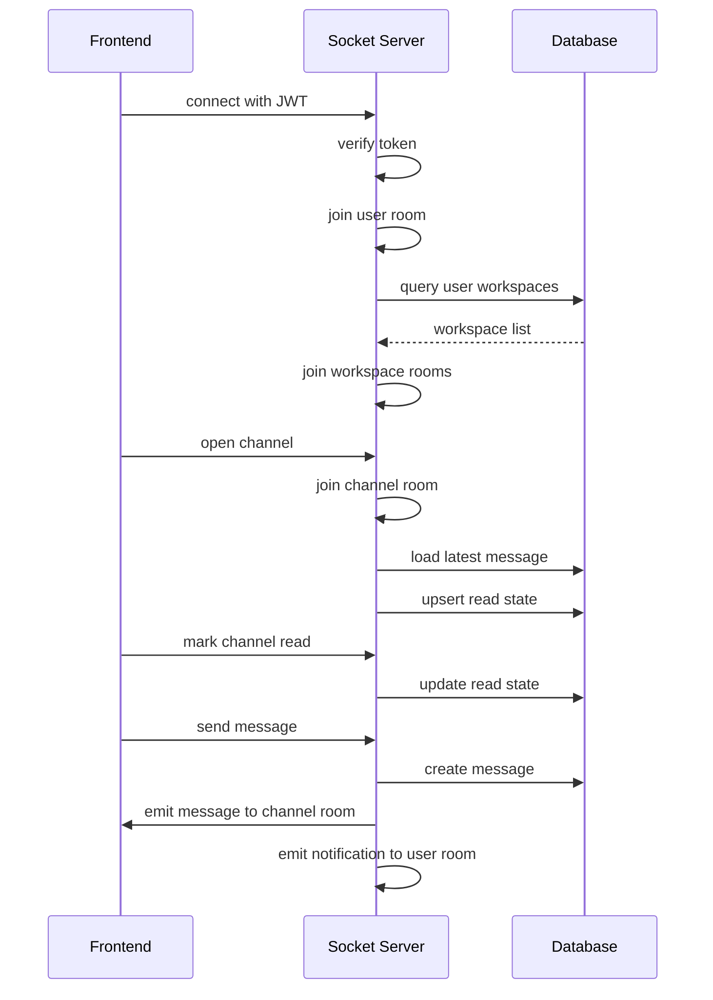
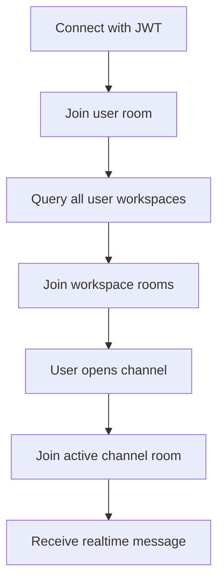
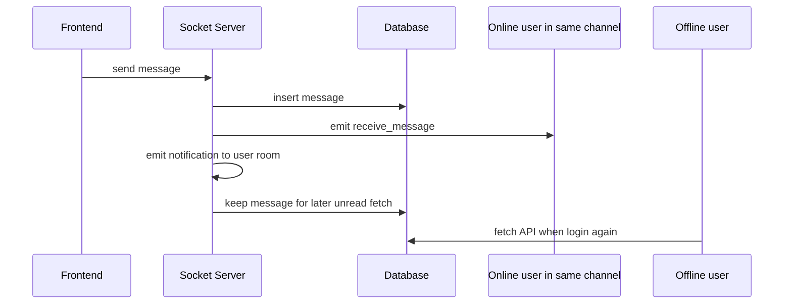

# Bổ sung trạng thái đọc theo channel cho từng user

> Tài liệu này mô tả cách thiết kế bảng lưu trạng thái đọc theo channel cho mỗi user, và cách tích hợp nó vào luồng Socket.IO hiện tại để xử lý unread cho cả user online lẫn offline.

---

## 1. Bài toán

Trong một workspace có nhiều thành viên, không phải lúc nào tất cả user cũng online cùng lúc.

- User online sẽ nhận realtime qua Socket.IO.
- User offline không nhận được event socket.
- Nếu chỉ emit notification mà không lưu state trong DB thì khi user quay lại, server không biết họ đã đọc tới đâu.

Vì vậy cần một bảng riêng để lưu trạng thái đọc của từng user theo từng channel.

---

## 2. Kết luận thiết kế

Nên lưu theo mô hình:

- 1 user + 1 channel = 1 record state
- Không lưu `isSeen` trên từng message
- Chỉ lưu mốc đọc cuối cùng của user trong channel đó

### Trường hợp nên dùng

- Tính unread cho channel
- Tính unread badge cho workspace
- Đồng bộ trạng thái đọc giữa nhiều thiết bị
- User offline quay lại vẫn biết đã có tin nhắn mới

### Trường hợp không nên dùng

- Lưu từng người đã xem cho từng message
- Lưu array user đã seen trong message

Mô hình đó sẽ phình rất nhanh khi số user và message tăng.

---

## 3. Bảng đề xuất

Tên bảng đề xuất: `channel_read_states`

### Schema logic

```prisma
model ChannelReadState {
  userId            BigInt    @map("user_id")
  channelId         BigInt    @map("channel_id")
  lastReadMessageId BigInt?   @map("last_read_message_id")
  lastReadAt        DateTime? @map("last_read_at")
  createdAt         DateTime  @default(now()) @map("created_at")
  updatedAt         DateTime  @updatedAt @map("updated_at")

  user    User    @relation(fields: [userId], references: [id], onDelete: Cascade)
  channel Channel @relation(fields: [channelId], references: [id], onDelete: Cascade)

  @@id([userId, channelId])
  @@index([channelId])
  @@map("channel_read_states")
}
```

### Ý nghĩa từng cột

- `userId`: user đang đọc
- `channelId`: channel được đọc
- `lastReadMessageId`: message cuối cùng user đã đọc
- `lastReadAt`: thời điểm đọc gần nhất
- `createdAt`, `updatedAt`: audit cơ bản

---

## 4. Cách tính unread

### Quy tắc cơ bản

Nếu `lastReadMessageId = 100` thì các message có id lớn hơn 100 được xem là chưa đọc.

```text
lastReadMessageId = 100
message 101 -> unread
message 102 -> unread
message 103 -> unread
```

### Khi chưa có record

Nếu user chưa từng mở channel đó thì không có row trong `channel_read_states`.

Khi đó có 2 cách xử lý:

1. Xem toàn bộ message trong channel là unread.
2. Tạo record mặc định khi user join channel lần đầu.

Khuyến nghị: tạo record khi user mở channel lần đầu, vì giúp query sau này đơn giản hơn.

---

## 5. Luồng socket đề xuất

### 5.1 Khi connect

Sau khi verify token:

1. Join room `user:<userId>`.
2. Join tất cả room `workspace:<workspaceId>` mà user thuộc về.
3. Chưa join channel nào.

Mục tiêu:

- User luôn nhận notification cá nhân.
- User luôn nhận event cấp workspace.
- Chỉ join channel khi thật sự mở.

### 5.2 Khi user mở channel

Client gửi event kiểu:

```ts
socket.emit('join_channel', { channelId })
```

Server xử lý:

1. Join room `channel:<channelId>`.
2. Lấy message mới nhất trong channel.
3. Upsert `ChannelReadState`.
4. Set `lastReadMessageId` = message mới nhất hiện tại.
5. Set `lastReadAt` = thời điểm hiện tại.

Như vậy, chỉ cần user đang xem channel thì trạng thái đọc đã được cập nhật.

### 5.3 Khi user rời channel

Client gửi:

```ts
socket.emit('leave_channel', { channelId })
```

Server chỉ cần leave room `channel:<channelId>`.

Không bắt buộc update read state ở bước này, vì đọc thật sự nên được chốt ở thời điểm user vào channel hoặc khi có hành động đánh dấu đã đọc.

### 5.4 Khi user cuộn tới cuối danh sách message

Đây là thời điểm tốt nhất để mark read.

Client gửi:

```ts
socket.emit('channel:mark_read', {
  channelId,
  lastReadMessageId
})
```

Server update record trong `channel_read_states`.

---

## 6. Luồng gửi tin nhắn

### Khi user A gửi message vào channel

Server làm 3 việc:

1. Lưu message vào DB.
2. Emit realtime vào room `channel:<channelId>`.
3. Emit notification vào room `user:<userId>` cho các user liên quan.

### Điểm quan trọng

Nếu user B offline thì user B không nhận event channel.
Nhưng server vẫn lưu message trong DB.

Khi user B login lại, unread badge được tính từ:

- message mới nhất trong channel
- `lastReadMessageId` của user B

---

## 7. Tính unread cho workspace

Không cần thêm bảng workspace seen ngay từ đầu.

Có thể suy ra unread workspace bằng cách:

1. Lấy tất cả channel thuộc workspace.
2. Với từng channel, so sánh message mới nhất với `lastReadMessageId`.
3. Nếu có ít nhất 1 channel unread thì workspace có unread.

### Ưu điểm

- Không nhân đôi dữ liệu
- Không phải đồng bộ thêm một state nữa
- Giữ logic nhất quán từ channel lên workspace

---

## 8. Tích hợp vào backend hiện tại

### Socket layer

File liên quan: `src/socket.ts`

Nên bổ sung:

- room helper: `user:<id>`, `workspace:<id>`, `channel:<id>`
- event `channel:mark_read`
- logic join workspace ngay sau connect
- logic update read state khi mở channel

### Service layer

Nên tách thêm service, ví dụ:

- `channel-read-state.services.ts`

Service này chịu trách nhiệm:

- upsert read state
- lấy unread count
- lấy message mới nhất của channel

### API layer

Nếu không muốn phụ thuộc hoàn toàn vào socket, có thể thêm REST API cho mark-read.

Ví dụ:

- `POST /channels/:channelId/read-state`
- `PATCH /channels/:channelId/read-state`

Socket dùng cho realtime, API dùng cho fallback hoặc khi user refresh trang.

---

## 9. Luồng xử lý khuyến nghị



---

## 10. Gợi ý triển khai thực tế

### Phase 1

- Thêm bảng `channel_read_states`
- Join `user:*` và `workspace:*` khi connect
- Update read state khi mở channel

### Phase 2

- Tính unread count cho từng channel
- Tính unread badge cho workspace
- Gắn notification riêng vào `user:*`

### Phase 3

- Đồng bộ đa thiết bị
- Fallback REST API nếu socket mất kết nối
- Tối ưu query unread bằng index và subquery

---

## 11. Lưu ý quan trọng

- Không nên lưu `isSeen` trong bảng `messages`.
- Không nên lưu mảng user đã xem trong message.
- Nên chuẩn hóa room name ngay từ đầu.
- Nên dùng một record duy nhất cho mỗi cặp `userId + channelId`.
- Nên cập nhật read state khi user thật sự đang mở channel, không chỉ khi nhận message.

---

## 12. Kết luận

Giải pháp phù hợp nhất cho hệ thống chat kiểu Discord là:

- `user:*` cho notification cá nhân
- `workspace:*` cho sự kiện cấp workspace
- `channel:*` cho realtime message
- `ChannelReadState` để lưu mốc đọc cuối cùng của user theo channel

Với cách này:

- User online vẫn nhận realtime.
- User offline vẫn có unread state chính xác.
- Không cần lưu trạng thái seen cho từng message.
- Dễ mở rộng và query hiệu quả.

---

## 13. Thiết kế tối ưu hơn: join workspace, chỉ join channel đang mở

Nếu mục tiêu của bạn là cân bằng giữa đơn giản và performance, đây là phương án tôi khuyên dùng hơn so với việc join tất cả channel.

### Ý tưởng cốt lõi

- Luôn join `user:<userId>` ngay khi connect.
- Join tất cả `workspace:<workspaceId>` mà user tham gia.
- Chỉ join `channel:<channelId>` khi user thật sự mở channel đó.
- Khi đổi channel thì leave channel cũ, join channel mới.

### Vì sao đây là phương án tốt hơn

- Số workspace của một user thường ít hơn rất nhiều so với số channel.
- Workspace room nhỏ, ổn định, dễ dùng cho event cấp cao.
- Channel room chỉ tồn tại khi user đang xem, nên giảm room count trên mỗi socket.
- Fanout message chỉ đi đến đúng người đang mở channel, không đẩy thừa.

### Luồng join đề xuất



### Luồng xảy ra khi có message



### Cách suy ra workspace unread

Workspace được xem là unread nếu tồn tại ít nhất một channel trong workspace có unread.

Quy tắc này vẫn giữ nguyên, nhưng query sẽ đi theo hướng:

1. Lấy danh sách channel thuộc workspace.
2. Đọc `ChannelReadState` của user cho từng channel.
3. Nếu có channel nào `lastReadMessageId < latestMessageId` thì workspace unread.

### Khi nào nên dùng phương án này

- Bạn muốn socket room ít hơn.
- Bạn muốn tránh join quá nhiều channel ngay lúc connect.
- Bạn muốn logic nhất quán với UI đang mở channel nào thì chỉ nhận realtime channel đó.

### Khi nào không nên dùng join tất cả channel

- User có quá nhiều channel.
- Hệ thống có nhiều tab/socket song song.
- Bạn muốn tối ưu memory và tránh broadcast rộng.

### Kết luận thực dụng

Phương án tối ưu nhất cho app chat kiểu Discord là:

- `user:*` để nhận notification cá nhân.
- `workspace:*` để nhận sự kiện cấp workspace.
- `channel:*` chỉ join khi user đang mở.
- `ChannelReadState` để giữ unread chính xác cho user offline và đa thiết bị.

Nếu bạn muốn đi nhanh ở phase đầu, có thể tạm join all channel. Nhưng nếu nhìn dài hạn, join workspace + join channel đang mở là cân bằng tốt hơn giữa đơn giản và performance.

---

## 14. Flow chốt cuối cùng để triển khai

### 14.1 Khi connect

1. Verify JWT.
2. Join `user:<userId>`.
3. Join tất cả `workspace:<workspaceId>` mà user tham gia.
4. Chưa join channel nào.

### 14.2 Khi user mở channel

1. Leave channel cũ nếu có.
2. Join `channel:<channelId>` mới.
3. Fetch message latest của channel.
4. Upsert `ChannelReadState`.
5. Client có thể reset badge channel đó về 0.

### 14.3 Khi có message mới trong channel

1. Lưu message vào DB.
2. Emit `receive_message` vào room `channel:<channelId>` cho user đang mở channel.
3. Emit `unread_update` vào room `workspace:<workspaceId>` hoặc `user:<userId>` cho user online nhưng không join channel đó.
4. Client nhận `unread_update` thì mark channel unread và suy ra workspace unread.
5. User offline không nhận socket, khi online lại thì fetch API để sync unread từ DB.

### 14.4 Nguồn sự thật

- Realtime socket chỉ để báo thay đổi.
- `ChannelReadState` trong DB mới là nguồn sự thật cho unread.
- Workspace unread chỉ là state UI suy ra từ channel unread.

### 14.5 Tóm tắt 1 dòng

`connect -> join user/workspace -> open channel thì join channel -> message mới thì emit realtime cho channel + emit unread cho workspace/user -> offline thì fetch API`
